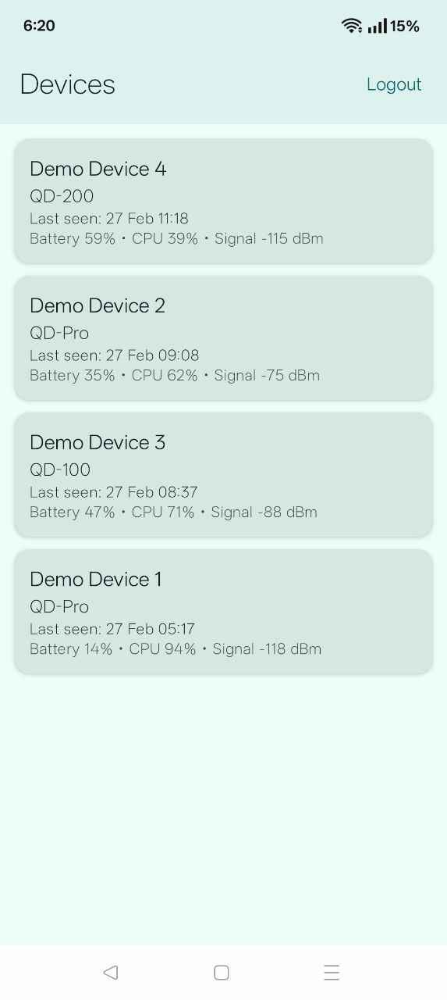
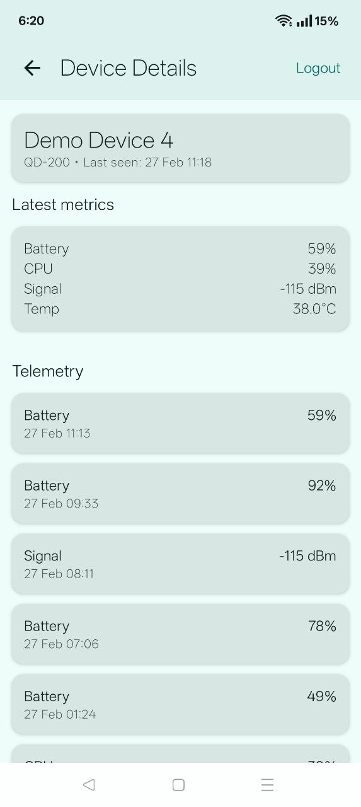
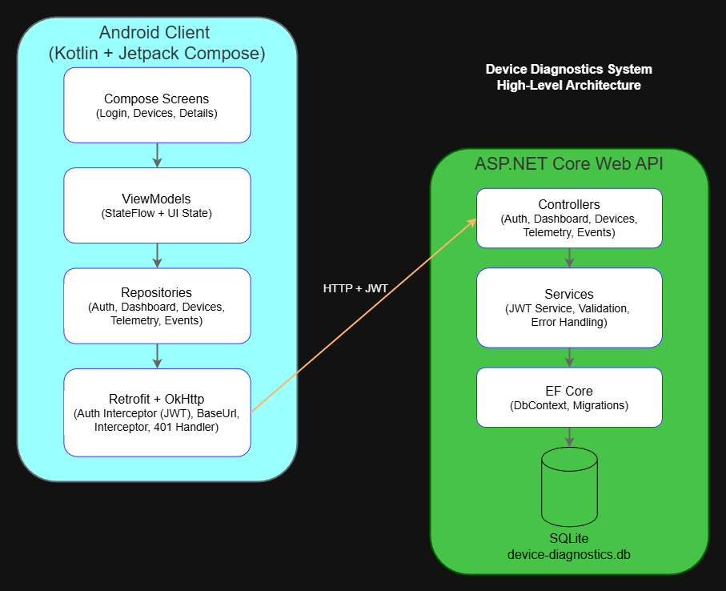

# Device Diagnostics System

Full-stack device diagnostics system with JWT authentication, telemetry ingestion, and Android dashboard client.

This project demonstrates end-to-end API design, secure authentication flow, and modern Android architecture using Jetpack Compose.

---

## Tech Stack

### Backend
- ASP.NET Core Web API
- Entity Framework Core
- SQLite (auto-migrated on startup)
- JWT authentication
- Swagger / OpenAPI

### Android Client
- Kotlin
- Jetpack Compose
- Retrofit + OkHttp
- DataStore (token persistence)
- StateFlow + ViewModel architecture

---

## Architecture Highlights

### Backend
- RESTful endpoints with per-user data isolation
- ProblemDetails-based structured error responses
- JWT-secured endpoints
- EF Core migrations + automatic DB initialization
- Aggregated dashboard endpoint for latest device metrics

### Android
- Token-driven navigation (auth-gated routing)
- Authorization header injected via OkHttp interceptor
- Automatic logout on HTTP 401
- Repository pattern + ViewModel state management
- Configurable backend host via in-app settings

---

## Repository Structure

```
/backend   – ASP.NET Core Web API
/android   – Android application
````
---

# 🚀 Quickstart

## 1. Run Backend

### Option A – Visual Studio
- Open `backend/DeviceDiagnostics.Api`
- Run the project
- Swagger UI:
  http://localhost:5275/swagger

### Option B – CLI

```bash
cd backend/DeviceDiagnostics.Api
dotnet restore
dotnet run
````

Database file will be created automatically at:

```
backend/DeviceDiagnostics.Api/data/device-diagnostics.db
```

---

## 2. Run Android App

* Open `/android` in Android Studio
* Run on emulator or physical device

### Emulator

Use:

```
http://10.0.2.2:5275
```

### Physical Device

1. Find your PC’s LAN IP (e.g. 192.168.x.x)
2. Open **Server Settings** in the app
3. Set:

   * Scheme: http
   * Host: your LAN IP
   * Port: 5275

---

# 🔐 Authentication Flow

* Register new user
* Login returns JWT
* Token stored securely in DataStore
* All protected requests include:

```
Authorization: Bearer <token>
```

* HTTP 401 triggers automatic logout

---

# 📊 Demo Flow

After login:

1. Tap **Demo data**
2. Backend seeds random devices, telemetry, and events
3. Dashboard displays:

   * Devices sorted by last activity
   * Latest metrics per device
4. Device Details screen shows:

   * Latest metrics
   * Recent telemetry
   * Recent events

---

# API Overview

## Auth

* POST /auth/register
* POST /auth/login

## Dashboard

* GET /dashboard/devices?metricsPerDevice=5

## Devices

* GET /devices
* POST /devices
* GET /devices/{id}

## Telemetry

* POST /devices/{id}/telemetry
* GET /devices/{id}/telemetry?fromUtc=&toUtc=&metric=

## Events

* POST /devices/{id}/events
* GET /devices/{id}/events

Swagger documentation available at:

```
/swagger
```

---

# Design Decisions

* **JWT only (no refresh tokens)**
  Chosen for simplicity and clarity in an MVP context.

* **No offline caching**
  Focus is API interaction and state-driven UI flow.

* **Token-driven navigation**
  UI reacts to authentication state changes instead of imperative navigation.

* **Backend-side dashboard aggregation**
  Keeps mobile client thin and avoids heavy client-side grouping.

---

# What This Project Demonstrates

* End-to-end system design
* Secure multi-user API
* Clean Android architecture with Compose
* Structured error handling
* Interceptor-based networking
* State-driven UI rendering
* 
## Screenshots

### Devices Dashboard


### Device Details


## Architecture


